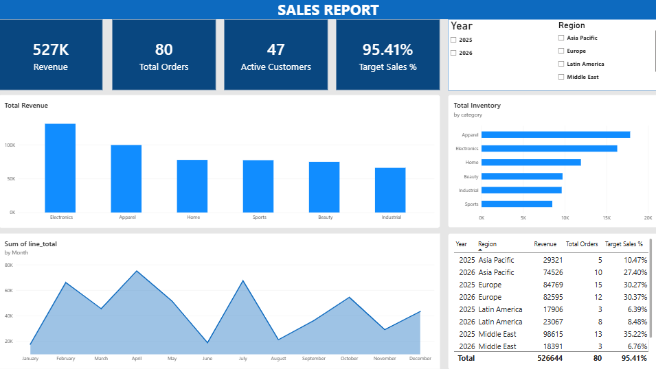

# 📊 Global Sales Performance Dashboard

**An interactive Power BI dashboard for monitoring revenue, orders, customers, inventory, and target attainment across regions and time.**


> Sales, inventory, order processing, targets, and campaign data — combined into a single analytical model, instead of scattered across separate reports.

## Table of Contents
- [Project Overview](#project-overview)
- [Dashboard at a Glance](#dashboard-at-a-glance)
- [Business Objective](#business-objective)
- [Report Features](#report-features)
- [Tech Stack](#tech-stack)
- [Data Model](#data-model)
- [Getting Started](#getting-started)
- [Repository Structure](#repository-structure)

---

## Project Overview

Sales teams often have to pull from multiple sources just to answer one question: *is revenue performing as expected?*

This dashboard brings the key business metrics into a single interactive Power BI report, so that question — and the ones around it — can be answered from one place:

- 💰 Revenue performance
- 🛒 Order activity
- 👥 Customer activity
- 🎯 Sales target attainment
- 📦 Inventory levels
- 🌎 Regional performance
- 📢 Campaign and promotion data

Built for **sales managers, business analysts, and operations teams** who need one consolidated view rather than five separate ones.

---

## Dashboard at a Glance



| Metric | Value |
|---|---|
| Revenue | **527K** |
| Total Orders | **80** |
| Active Customers | **47** |
| Target Sales % | **95.41%** |

---

## Business Objective

The report is built to answer questions like:

- Are sales on track against target?
- Which regions are generating the most revenue?
- Which product categories contribute the most sales?
- Are inventory levels aligned with sales demand?
- Which regions or categories need further investigation?
- Can campaign and promotion data be connected to sales performance?

Rather than analyzing these areas separately, the dashboard brings them together into one interactive report.

---

## Report Features

- 📈 **Revenue by category** — bar chart ranking product categories (Electronics leads, followed by Apparel, Home, Sports, Beauty, and Industrial)
- 📊 **Inventory by category** — horizontal bar chart, so stock levels can be checked against sales performance at a glance
- 📉 **Monthly revenue trend** — a full Jan–Dec view of `line_total` to spot seasonality
- 🌍 **Year × Region breakdown** — Revenue, Total Orders, and Target Sales % split across 2025/2026 and all four regions, with grand totals
- 🎚️ **Interactive filtering** — slice the whole report by Year and Region

---

## Tech Stack

| Tool / Technology | Purpose |
|---|---|
| **Power BI Desktop** | Dashboard development and data visualization |
| **Power Query** | Data cleaning, transformation, and preparation |
| **DAX** | Measures, KPIs, calculations, and business logic |
| **Data Modeling** | Connecting fact and dimension tables |
| **Row-Level Security (RLS)** | Restricting regional data access by user |
| **Power BI Template (.pbit)** | Reusable report development format |

---

## Data Model

The report uses a **star-schema-style data model**, with multiple fact tables connected to shared dimensions.

**Fact tables**
- `fact_sales`
- `fact_inventory`
- `fact_order_process`
- `fact_campaign_spend`
- `fact_promotion_coverage`
- `fact_sales_targets`

**Dimension tables**
- `dim_customer`
- `dim_product`
- `dim_geo`
- `dim_date`
- `dim_campaign`
- `dim_order_flags`

A dedicated `_measures` table keeps DAX measures organized and separate from the data tables.

```text
                         ┌───────────────┐
                         │  dim_customer │
                         └───────┬───────┘
                                 │
                                 │
┌────────────┐           ┌───────▼───────┐           ┌─────────────┐
│  dim_date  │──────────▶│   fact_sales  │◀──────────│ dim_product │
└────────────┘           └───────┬───────┘           └─────────────┘
                                 │
                    ┌────────────┼────────────┐
                    │            │            │
                    ▼            ▼            ▼
             fact_inventory  sales_targets  dim_geo
                    │
                    │
                    ▼
             Inventory Analysis

       Marketing & Promotion Data
                    │
          ┌─────────┴──────────┐
          ▼                    ▼
 fact_campaign_spend   fact_promotion_coverage
          │                    │
          └─────────┬──────────┘
                    ▼
            Campaign Analysis
```

---

## Getting Started

1. **Clone or download** this repository.
2. **Open `Sales_Report.pbit`** in [Power BI Desktop](https://www.microsoft.com/en-us/power-platform/products/power-bi/desktop) (free).
3. This is a **template (`.pbit`)**, not a `.pbix` — it ships with the full data model, report pages, and DAX measures, but no embedded data. On first open, Power BI will prompt you to connect a data source (or fill in any parameters the template defines).
4. **Refresh the model** once connected to populate the visuals.

---

## Repository Structure

```
Sales-Report-main/
│
├── Sales_Report.pbit              # Power BI report template (model + visuals, no embedded data)
├── Snapshot_of_the_dashboard.png  # Preview of the report
└── README.md
```
